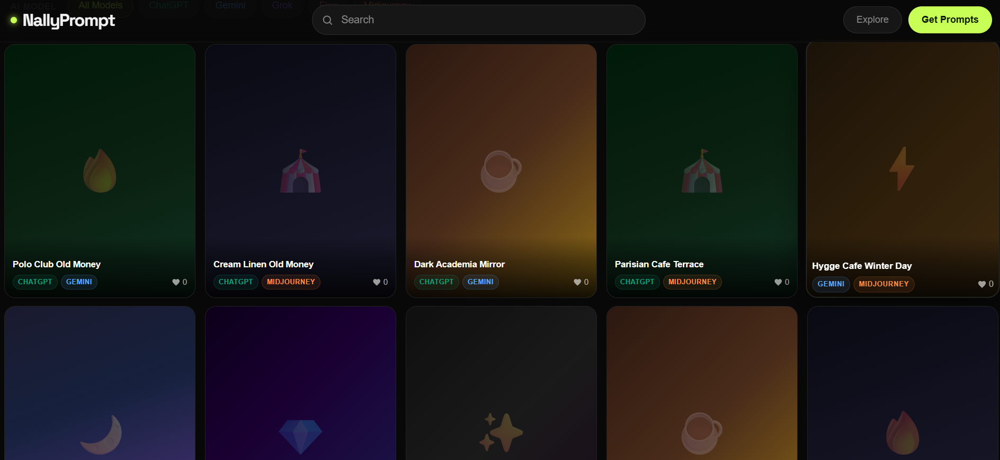

# MintPrompt 🌿

<p align="center">
  
</p>

<p align="center">
  <strong>AI Aesthetic Prompt Discovery Platform</strong>
</p>

<p align="center">
  Browse curated AI image prompts for ChatGPT, Gemini, Grok, Midjourney & Flux.
  <br/>
  Discover aesthetic visuals, copy prompts instantly, and explore inspired products.
</p>

---

<p align="center">

  <a href="https://your-demo.vercel.app">
    
  </a>

  <a href="https://github.com/your-username/mintprompt">
    
  </a>

  
  
  

</p>

---

## ✨ Overview

MintPrompt is a modern AI prompt discovery platform focused on aesthetic and Gen Z-style visual inspiration.

Users can:

* Browse curated AI prompts
* Filter by AI model and category
* Copy prompts instantly
* Explore visual inspiration
* Discover affiliate-style product recommendations

This repository is a **public showcase/demo version** prepared for GitHub sharing.

> ⚠️ All backend functionality has been replaced with local mock/demo data.
> No real Supabase credentials or production secrets are included.

---
# 🚀 Live Demo

### 🌐 Demo Website

👉 [https://your-demo.vercel.app](https://nallyprompt.vercel.app)

---

# ✨ Features

* 🖼️ AI prompt gallery
* 🔍 Category & model filters
* 📋 One-click copy prompt
* 🔗 Affiliate showcase cards
* 🌙 Dark aesthetic UI
* 📱 Fully responsive layout
* ⚡ Infinite scrolling
* 🎨 Gen Z visual style
* 🔒 Demo admin dashboard
* 🧪 Local mock API system

---

# 🛠️ Tech Stack

| Technology   | Usage                                     |
| ------------ | ----------------------------------------- |
| Next.js 15   | App Router Framework                      |
| TypeScript   | Type-safe frontend                        |
| Tailwind CSS | Styling                                   |
| Supabase     | Production backend (removed in demo mode) |
| Vercel       | Deployment                                |

---

# 📦 Installation

## 1. Clone Repository

```bash
git clone https://github.com/your-username/mintprompt.git
cd mintprompt
```

## 2. Install Dependencies

```bash
npm install
```

## 3. Create Environment File

```bash
cp .env.example .env.local
```

## 4. Start Development Server

```bash
npm run dev
```

Open:

```txt
http://localhost:3000
```

---

# 🧪 Demo Mode

This showcase version runs entirely on local mock data.

| Feature            | Demo Mode   | Production  |
| ------------------ | ----------- | ----------- |
| Prompt Gallery     | ✅           | ✅           |
| Filters            | ✅           | ✅           |
| Prompt Detail      | ✅           | ✅           |
| Copy Prompt        | ✅           | ✅           |
| Admin Dashboard    | ✅ Read-only | ✅ Full CRUD |
| Authentication     | ❌ Disabled  | ✅           |
| Analytics          | ❌ Mocked    | ✅           |
| Image Upload       | ❌ Disabled  | ✅           |
| Affiliate Tracking | ❌ Mocked    | ✅           |

---

# 📁 Project Structure

```txt
src/
├── app/
│   ├── admin/
│   ├── api/
│   └── prompt/
├── components/
├── hooks/
├── lib/
├── types/
mock/
supabase/
```

---

# 🔒 Public Showcase Changes

This repository was sanitized for safe public GitHub sharing.

## Removed

* Production Supabase credentials
* Service role keys
* Real authentication
* Payment systems
* Analytics tracking
* Storage uploads
* Backend write operations
* Affiliate tracking backend

## Replaced With

* Local mock data
* Demo APIs
* Read-only admin dashboard
* No-op analytics
* Demo middleware
* Placeholder affiliate system

---

# 🌱 Future Plans

* AI-generated collections
* Community prompt uploads
* Saved favorites
* Visual search
* Multi-model comparison
* Public creator profiles

---

# 📄 License

MIT License

---

<p align="center">
  Built with ☕ + aesthetic obsession.
</p>
